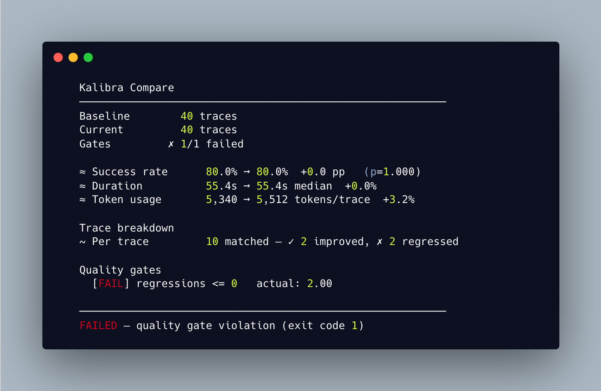

<p align="center">
  <strong>Kalibra</strong><br>
  Regression detection and CI quality gates for AI agents.
</p>

<p align="center">
  <a href="https://pypi.org/project/kalibra/"></a>
  <a href="https://pypi.org/project/kalibra/"></a>
  <a href="https://github.com/khan5v/kalibra/LICENSE"></a>
  <a href="https://kalibra.cc"></a>
</p>

<p align="center">
  
</p>

Success rate: 80% → 80%. Duration: flat. Tokens: flat. Everything looks the same — but 2 task types that always passed started failing, and 2 that always failed started passing. The aggregate hid it. The [per-task breakdown caught it](/blog/kalibra-regression-detection/).

---

```bash
pip install kalibra
kalibra compare baseline.jsonl current.jsonl -v
kalibra demo    # try it with sample data
```

- **Statistical rigor** — bootstrap 95% CIs on continuous metrics, two-proportion z-test on rates
- **Quality gates** — `regressions <= 2` fails your CI pipeline (exit 1) when thresholds are violated
- **Per-task and per-span breakdown** — catches regressions that cancel out in the aggregate
- **Two dependencies** — click + pyyaml. No ML frameworks, no API keys, no LLM calls

## Quality gates for CI

```yaml
# kalibra.yml
baseline:
  path: ./baselines/production.jsonl
current:
  path: ./eval-output/canary.jsonl

require:
  - success_rate_delta >= -2     # max 2pp success rate drop
  - regressions <= 5             # max 5 tasks regressed
  - cost_delta_pct <= 20         # max 20% cost increase
```

```bash
kalibra compare        # reads kalibra.yml, exits 1 on failure
```

### GitHub Actions

```yaml
- uses: khan5v/kalibra-action@v1
  with:
    baseline: baselines/production.jsonl
    current: current.jsonl
    config: kalibra.yml
```

Posts a markdown report as a PR comment. Exits 1 on gate failure.

<details>
<summary>Full workflow example</summary>

```yaml
name: Agent Quality Gate
on: [pull_request]

jobs:
  kalibra:
    runs-on: ubuntu-latest
    permissions:
      pull-requests: write
    steps:
      - uses: actions/checkout@v5
      - run: python eval.py --output current.jsonl
      - uses: khan5v/kalibra-action@v1
        with:
          baseline: baselines/production.jsonl
          current: current.jsonl
          config: kalibra.yml
```

</details>

## Integrations

Kalibra auto-detects trace formats. Each tutorial works without an API key.

| Integration | Trace format | Demo scenario | Tutorial |
|---|---|---|---|
| **Phoenix / OpenInference** | `llm.*`, `openinference.*` | Multi-step agent with span tree aggregation | [](https://colab.research.google.com/github/khan5v/kalibra/blob/main/examples/phoenix_kalibra_tutorial.ipynb) |
| **OTel GenAI** | `gen_ai.*` | Truncation regression hidden by aggregate improvement | [](https://colab.research.google.com/github/khan5v/kalibra/blob/main/examples/otel_genai/otel_genai_tutorial.ipynb) |
| **CrewAI** | Flat JSONL | Failure redistribution and cost explosion | [](https://colab.research.google.com/github/khan5v/kalibra/blob/main/examples/crewai/crewai_kalibra_tutorial.ipynb) |

<details>
<summary>Filtering with <code>where</code></summary>

Split a single trace file into populations using Prometheus-style matchers:

```yaml
sources:
  baseline:
    path: ./traces.jsonl
    where:
      - variant == baseline
  current:
    path: ./traces.jsonl
    where:
      - variant == current
```

Operators: `==` (equal), `!=` (not equal), `=~` (regex match), `!~` (regex not match). Multiple matchers are ANDed. Traces missing the field are excluded.

</details>

<details>
<summary>Field mapping</summary>

Kalibra works with any JSONL shape. Map your fields in config or on the command line:

```yaml
fields:
  outcome: metadata.result
  cost: agent_cost.total_cost
  task_id: metadata.task_name
```

```bash
kalibra compare a.jsonl b.jsonl --outcome metadata.result --cost usage.total_cost
```

Override fields per source for different schemas:

```yaml
baseline:
  path: ./langfuse.jsonl
  fields: { outcome: metadata.result, cost: usage.total_cost }
current:
  path: ./braintrust.jsonl
  fields: { outcome: scores.correctness, cost: metrics.cost }
```

</details>

<details>
<summary>Python API</summary>

```python
from kalibra.loader import load_traces
from kalibra.engine import compare
from kalibra.renderers import render

baseline = load_traces("baseline.jsonl")
current = load_traces("current.jsonl")

result = compare(baseline, current, require=["success_rate_delta >= -5"])
print(render(result, "terminal", verbose=True))
print("passed:", result.passed)
```

</details>

## Development

```bash
git clone https://github.com/khan5v/kalibra.git
cd kalibra
python -m venv .venv && source .venv/bin/activate
pip install -e ".[dev]"
pytest
```
