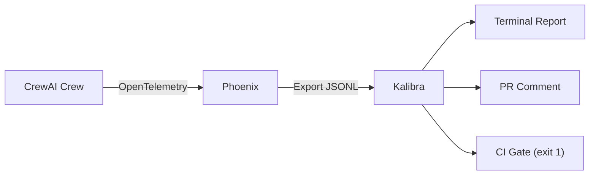

# Operational regression detection for CrewAI crews

`crewai test` evaluates output quality with an LLM judge. Kalibra covers the other side: **operational regressions** — token cost, failure patterns, latency — using deterministic statistical comparison on trace data. They're complementary.

## Two scenarios

### 1. Failure redistribution

You swap the model. `crewai test` score: 7.5 → 7.4. Aggregate success: 80% → 80%.

Kalibra shows: `migration_plan` and `review_arch` went from 4/4 → 0/4. `compare_dbs` and `design_auth` went from 0/4 → 4/4. The failure distribution shifted completely — regressions and improvements canceled in the aggregate.

```
≈ Success rate      80.0% → 80.0%  +0.0 pp   (p=1.000)

Trace breakdown
  ~ Per trace       10 matched — ✓ 2 improved, ✗ 2 regressed
                    ▼ migration_plan   succeeded: 4/4 → 0/4
                    ▼ review_arch      succeeded: 4/4 → 0/4
                    ▲ compare_dbs      succeeded: 0/4 → 4/4
                    ▲ design_auth      succeeded: 0/4 → 4/4

Quality gates
  [FAIL] regressions <= 0   actual: 2.00
```

### 2. Cost explosion

You enable chain-of-thought. `crewai test` score: 8.0 → 8.5. Success: 75% → 90%.

Kalibra shows: tokens per trace jumped 35%. The success improvement isn't even statistically significant (p=0.077). You're paying a third more per trace for a marginal gain.

```
≈ Success rate      75.0% → 90.0%  +15.0 pp   (p=0.077)
▼ Token usage       5,353 → 7,212 tokens/trace  +34.7%

Quality gates
  [FAIL] token_delta_pct <= 20   actual: 34.70
  [ OK ] regressions <= 0        actual: 0.00
```

## How it works



## Quick start

```bash
pip install kalibra

cd examples/crewai
# Redistribution scenario
kalibra compare --config scenario_redistribution.yml -v
# Cost explosion scenario
kalibra compare --config scenario_cost_explosion.yml -v
```

## Interactive notebook

The notebook runs both scenarios with full output, markdown PR preview, and interpretation. No API key needed.

[](https://colab.research.google.com/github/khan5v/kalibra/blob/main/examples/crewai/crewai_kalibra_tutorial.ipynb)

## Different tools for different problems

| | Quality evaluation (`crewai test`) | Operational detection (Kalibra) |
|---|---|---|
| What it answers | "Is the output good?" | "Did cost, success, or latency change?" |
| Method | LLM-as-judge scoring | Bootstrap CIs, p-values, per-task breakdown |
| Token / cost tracking | Not built in | Per trace and per span |
| Deterministic | No — LLM judge varies per run | Yes — pure computation |
| CI gates | Not built in | Exit code 1 on gate failure |

Community discussions show demand for both sides:
[consistent scoring](https://community.crewai.com/t/crew-how-to-keep-the-consistency-of-score/1422),
[per-task token tracking](https://github.com/crewAIInc/crewAI/issues/933),
[cost tracking per customer](https://community.crewai.com/t/how-do-you-track-llm-cost-per-customer-for-crewai-workflows/7426),
[A/B testing](https://github.com/crewAIInc/crewAI/issues/3015).
Kalibra fills the operational side of that gap.

## Links

- [Kalibra](https://github.com/khan5v/kalibra) — regression detection for AI agents
- [Phoenix](https://github.com/Arize-ai/phoenix) — trace collection
- [CrewAI testing docs](https://docs.crewai.com/concepts/testing)
